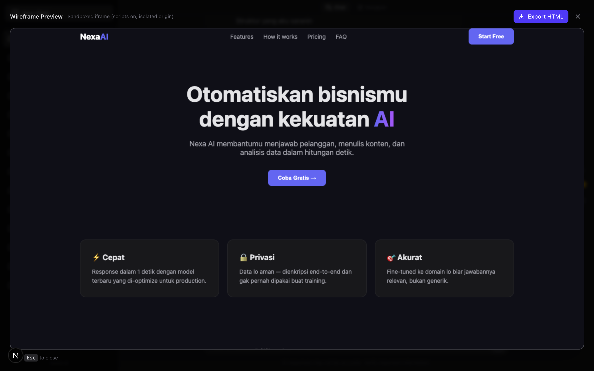
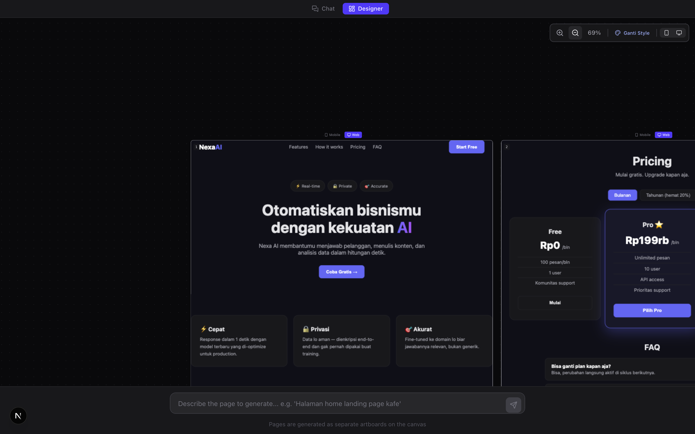
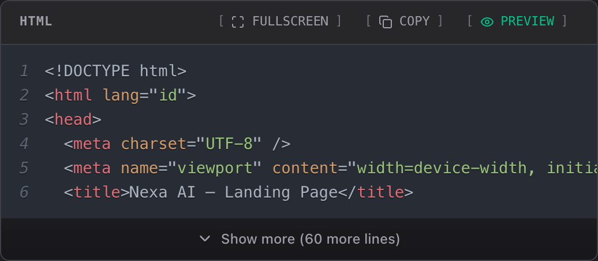

# wowo.ai

AI-powered chat & designer platform untuk bikin landing page dan web design secara instan.

## Fitur Utama

### Chat Interface
- AI chat dengan conversation history sidebar
- Quote & reply pesan sebelumnya untuk konteks yang lebih baik
- Bookmark pesan penting untuk referensi nanti
- Text selection toolbar untuk quick copy & quote

### Code Blocks
- Syntax highlighting untuk HTML, CSS, JavaScript, dan lainnya
- Fullscreen mode untuk melihat kode lebih jelas
- One-click copy ke clipboard
- Live preview langsung dari code block

### Designer Mode
- Visual design canvas dengan multiple artboards
- Generate halaman dari deskripsi teks
- Ganti style instant (Default, natural-tone, dll)
- Zoom controls untuk detail yang lebih baik
- Mobile/Web toggle untuk preview responsive

### Wireframe Preview
- Preview hasil design dalam iframe sandboxed
- Export HTML untuk kebutuhan production
- Responsive preview (mobile & desktop)

## Tech Stack

- **Framework**: Next.js 16
- **UI**: Tailwind CSS 4
- **AI**: Vercel AI SDK
- **Database**: Prisma + PostgreSQL
- **Language**: TypeScript

## NeedMCP Integration

**NeedMCP** ([https://needmcp.com](https://needmcp.com)) adalah MCP server design system yang dipakai buat fitur **"Ganti Style"** di Designer Mode. Perannya: nyediain design system (warna, typography, spacing, rounded, komponen, layout, wireframe) untuk style tertentu — AI pakai itu sebagai *grounding* biar hasil generate halaman konsisten sama design language yang dipilih user.

Integrasinya **opsional**. Tanpa API key, semua behavior jalan normal dengan style bawaan wowo.ai. Kalo aktif, flow-nya: user pilih style → style di-lock ke session → AI pre-fetch design tokens style tsb → HTML yang dihasilkan grounded ke design system-nya.

### Cara dapetin API key

1. Register/login di [https://needmcp.com](https://needmcp.com)
2. Ambil API key dari NeedMCP Dashboard
3. Set di file `.env`:

```
NEEDMCP_API_KEY="your-api-key"
```

Kosongin atau hapus variabel ini kalau mau matiin integrasinya. Contoh lengkap ada di `.env.example`.

## Getting Started

```bash
# Setup environment: bikin .env (SQLite + LLM), install deps, migrate database
chmod +x setup.sh && ./setup.sh

# Run development server
npm run dev
```

Buka [http://localhost:3000](http://localhost:3000) di browser.

> `.env` hasil `setup.sh` itu minimal (cuma database + LLM). Untuk fitur PDF scan,
> tambahkan `OCR_BASE_URL` & `OCR_LANGUAGE` secara manual — lihat **OCR Service** di bawah.

## OCR Service (PDF Scan)

wowo.ai punya **Document Router** untuk PDF yang di-upload ke chat:

- **native** — PDF punya text layer → teks di-extract langsung (murah & cepat)
- **vision** — PDF kompleks/visual → halaman di-render ke gambar, dibaca vision model
- **ocr** — PDF scan (gambar-heavy, multilingual) → di-route ke **OCR service** (PaddleOCR)

> ⚠️ **Service OCR ini repo terpisah & private** — bukan bagian dari repo ini.
> Kamu harus setup sendiri service OCR-nya dulu sebelum fitur baca PDF scan jalan penuh.
> Kalau service OCR belum ada / mati, PDF scan otomatis **fallback ke vision model**
> (app tetap jalan, hasil bacanya lewat VLM).

### 1. Setup service OCR (repo terpisah)

Clone repo OCR (PaddleOCR + FastAPI) dari tempat lain, lalu jalanin:

```bash
git clone <url-repo-ocr-private>
cd <folder-repo-ocr>

# Docker — direkomendasikan (image ~2GB, build pertama agak lama)
docker compose up -d --build

# atau tanpa Docker (venv Python)
bash setup.sh
bash run.sh
```

Cek service-nya hidup:

```bash
curl http://127.0.0.1:8000/health
# {"ok": true, "engine": "paddleocr"}
```

### 2. Konfigurasi wowo.ai

`./setup.sh` bikin `.env` minimal — tambahkan 2 variabel ini secara manual:

```
# .env — tambahkan setelah jalankan ./setup.sh
OCR_BASE_URL="http://127.0.0.1:8000"   # URL service OCR
OCR_LANGUAGE="ch"                       # bahasa PaddleOCR (ch/en/japan/...)
```

- `OCR_BASE_URL` kosong → PDF scan yang di-route `ocr` langsung fallback ke vision.
- `OCR_LANGUAGE` default `ch`, bisa diubah per bahasa (`en`, `japan`, dst).

### 3. Test OCR

Render satu halaman PDF scan ke PNG, lalu kirim ke service:

```bash
curl -F "files=@page.png" http://127.0.0.1:8000/ocr
# {"pages": [{"page": 1, "text": "...", "confidence": 0.97, "blocks": [...]}]}
```

> Catatan: OCR service bind ke `127.0.0.1` — cocok kalau wowo.ai jalan di **host** yang
> sama. Kalau wowo.ai ikut di-dockerize, sesuaikan network & host bind-nya.

## Screenshots

| Chat Interface | Designer Mode |
|----------------|---------------|
|  |  |

| Code Blocks | Wireframe Preview |
|-------------|-------------------|
|  |  |

## License

Private - All rights reserved.
